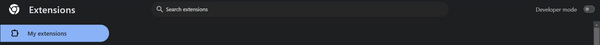

#Chrome To-Do List Extension

A simple Chrome extension to manage your to-do list directly from the browser.

## Features

- Add new tasks
- Remove tasks
- Tasks are saved using Chrome's `storege.sync` to sync devices

## Installation

1. Clone the repository: `git clone https://github.com/Shavindu-Gayashan/to-do-list-chrome-extension`
2. Open Chrome and navigate to `chrome://extensions/`
3. Enable "Developer mode" by toggling the switch in the top right corner.
4. Click "Load unpacked" and select the cloned repository folder.   
   

## Files

- `manifest.json`: Configuration file for the Chrome extension.\
- `popup.html`: HTML file for the extension's popup.
- `popup.js`: JavaScript file for handling task logic.
- `styles.css`: CSS file for styling the popup.
- `icons`: Icons for the extension.

## Usage

1. Click the extension icon in the Chrome toolbar.
2. Add new tasks using the input field and "Add" button.
3. Remove tasks by clicking the "Remove" button next to each task.   

## Contributing

Contributions are welcome! Please open an issue or submit a pull request for any improvements or suggestions.

## Author

GitHub: [Shavidu Gayashan](https://github.com/Shavindu-Gayashan)
