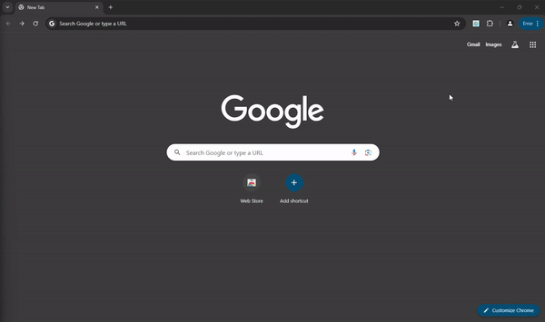

<div align="center">
  
  <h1>Chrome To-Do List Extension</h1>
  <p>A sleek, feature-rich Chrome extension to manage your tasks with ease</p>
  
  
  
  [](https://twitter.com/yourusername)
  
</div>

---

## ✨ Features



- 📝 **Task Management**
  - Add new tasks quickly
  - Mark tasks as complete with visual indicators
  - Remove tasks individually
  - Clear all tasks at once

- 🎨 **Modern Interface**
  - Clean, intuitive design
  - Responsive layout
  - Tooltips for better usability

- 🌓 **Theme Options**
  - Light mode for day use
  - Dark mode for night work
  - Auto-detects system preferences

- ☁️ **Sync Across Devices**
  - Tasks automatically sync using Chrome Storage
  - Access your to-do list on any device

## 🚀 Installation

### From Source Code

1. Clone the repository:
   ```bash
   git clone https://github.com/Shavindu-Gayashan/to-do-list-chrome-extension
   ```

2. Open Chrome and navigate to:
   ```
   chrome://extensions/
   ```

3. Enable "Developer mode" by toggling the switch in the top right corner

4. Click "Load unpacked" and select the cloned repository folder

<div align="center">
  
</div>

### From Chrome Web Store
*(Coming Soon)*

## 🔧 How to Use

1. Click the extension icon in your Chrome toolbar to open the to-do list
2. Add tasks using the input field and clicking "Add" (or press Enter)
3. Mark tasks as completed by clicking the checkmark button
4. Remove tasks with the trash button
5. Switch between light and dark themes with theme buttons
6. Clear all tasks at once with the "Clear All Tasks" button

## 📁 Project Structure

```
to-do-list-chrome-extension/
├── manifest.json     # Extension configuration
├── popup.html        # Main extension interface
├── popup.js          # Task management logic
├── styles.css        # Extension styling
└── assets/
    └── icons/        # Extension icons
    └── img/          # Documentation images
```

## 📸 Screenshots

<div align="center">
  <table>
    <tr>
      <td align="center">
        <br>
        <em>Light Theme</em>
      </td>
      <td align="center">
        <br>
        <em>Dark Theme</em>
      </td>
    </tr>
    <tr>
      <td align="center">
        <br>
        <em>With Tasks</em>
      </td>
      <td align="center">
        <br>
        <em>Completed Tasks</em>
      </td>
    </tr>
  </table>
</div>

## 🔮 Future Enhancements

- [ ] Task categories and labels
- [ ] Due dates and reminders
- [ ] Priority levels for tasks
- [ ] Task sorting and filtering
- [ ] Import/export functionality
- [ ] Custom themes and personalization

## 🤝 Contributing

Contributions are always welcome! Here's how you can help:

1. Fork the repository
2. Create a feature branch: `git checkout -b new-feature`
3. Make your changes and commit: `git commit -m 'Add some feature'`
4. Push to the branch: `git push origin new-feature`
5. Open a pull request

Please make sure to update tests as appropriate and follow the code style guidelines.

## 📜 License

This project is licensed under the MIT License - see the [LICENSE](LICENSE) file for details.

## 👤 Author


**Shavindu Gayashan**

[](https://github.com/Shavindu-Gayashan)
[](https://linkedin.com/in/shavindu-gayashan)

<br>

---

<div align="center">
  <sub>Built with ❤️ by Shavindu Gayashan</sub>
</div>

